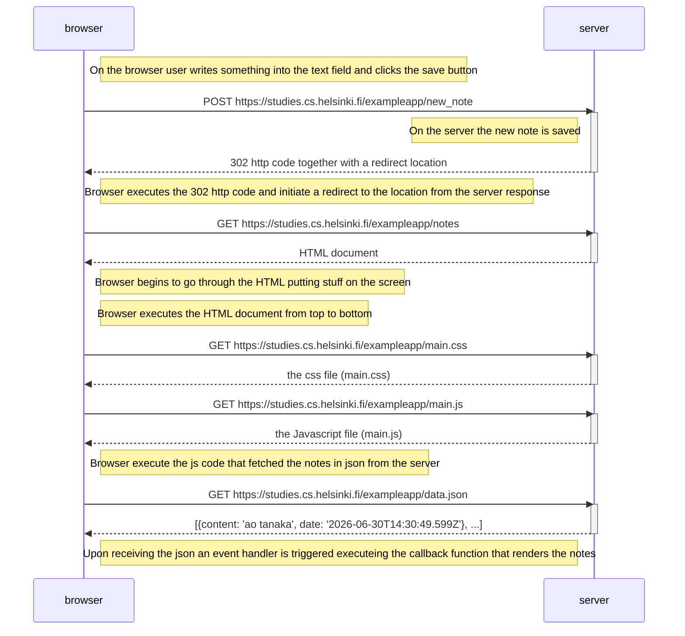

```mermaid

sequenceDiagram

    participant browser
    participant server

    Note right of browser: On the browser user writes something into the text field and clicks the save button

    browser->>server: POST https://studies.cs.helsinki.fi/exampleapp/new_note

    activate server
    Note left of server: On the server the new note is saved 

    server-->>browser: 302 http code together with a redirect location
    deactivate server

    Note right of browser: Browser executes the 302 http code and initiate a redirect to the location from the server response

    browser->>server: GET https://studies.cs.helsinki.fi/exampleapp/notes

    activate server
    server-->>browser: HTML document
    deactivate server

    Note right of browser: Browser begins to go through the HTML putting stuff on the screen

    Note right of browser: Browser executes the HTML document from top to bottom

    browser->>server: GET https://studies.cs.helsinki.fi/exampleapp/main.css

    activate server
    server-->>browser: the css file (main.css)
    deactivate server

    browser->>server: GET https://studies.cs.helsinki.fi/exampleapp/main.js

    activate server
    server-->>browser: the Javascript file (main.js)
    deactivate server

    Note right of browser: Browser execute the js code that fetched the notes in json from the server

    browser->>server: GET https://studies.cs.helsinki.fi/exampleapp/data.json

    activate server
    server-->>browser: [{content: 'ao tanaka', date: '2026-06-30T14:30:49.599Z'}, ...]
    deactivate server

    Note right of browser: Upon receiving the json an event handler is triggered executeing the callback function that renders the notes


```
