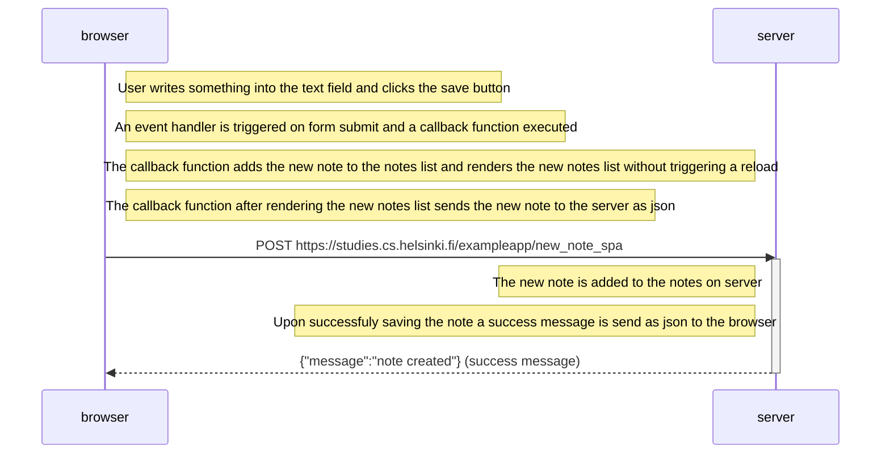

```mermaid

sequenceDiagram
    participant browser
    participant server

    Note right of browser: User writes something into the text field and clicks the save button

    Note right of browser: An event handler is triggered on form submit and a callback function executed

    Note right of browser: The callback function adds the new note to the notes list and renders the new notes list without triggering a reload 

    Note right of browser: The callback function after rendering the new notes list sends the new note to the server as json

    browser->>server: POST https://studies.cs.helsinki.fi/exampleapp/new_note_spa

    activate server
    Note left of server: The new note is added to the notes on server
    Note left of server: Upon successfuly saving the note a success message is send as json to the browser

    server-->>browser: {"message":"note created"} (success message)
    deactivate server

```

